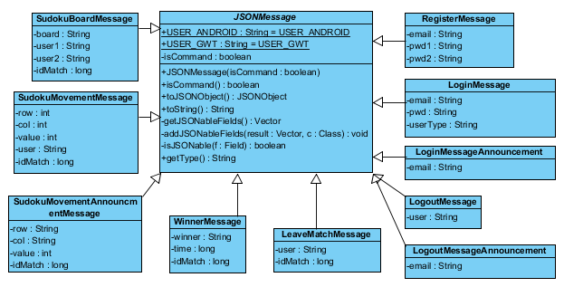
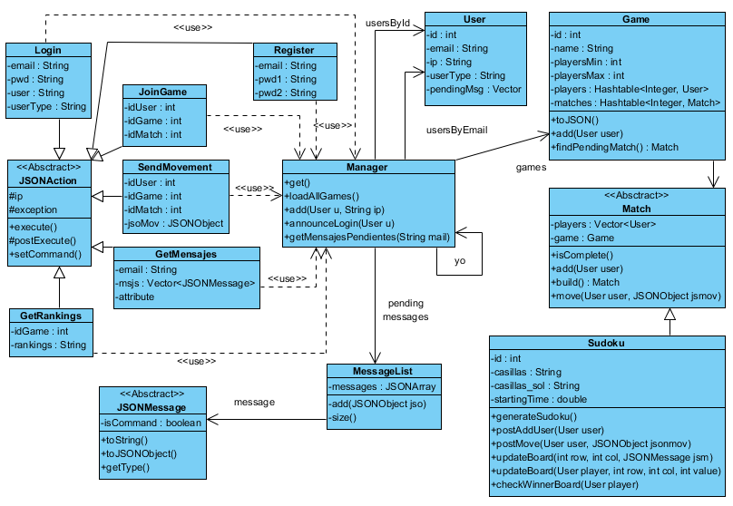

# Sudoku - Server
*Client/server implementation of the classic game we all love*
***
This repository is focused on the **server** development. 
Should you wish to check the Android client, visit [GitHub - jamlkht](https://github.com/jamlkht/ClienteJuegos)

The server should hold the following funtionalities,

  

The architectonic design of the solution would be the following,

The class diagram of the messages is the next,

And the diagram with the most important calsses of the server is the following,

